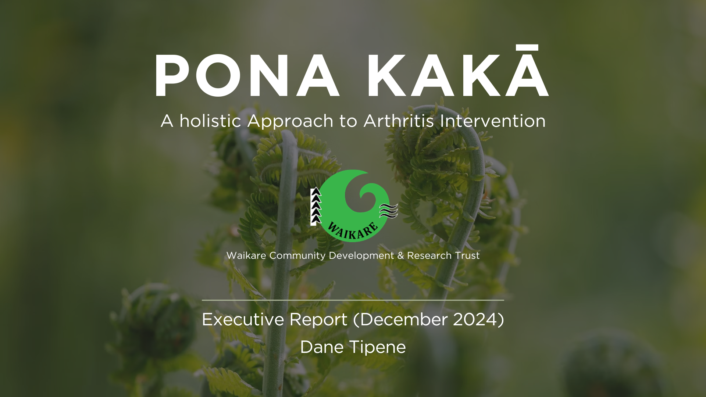

 

**I walk into broken, expensive, manual processes and automate them out of existence.**

Analytics & Automation Engineer with a track record of delivering production-grade automation and AI pipelines inside highly regulated government environments.

This portfolio documents that work — real problems, real outcomes, and the analytical depth that makes the automation meaningful.

 

## Automation & AI Pipelines  

**Production deployments. Real environments. Measurable outcomes.**

### WhisperX Transcription Pipeline

*What do you do when 3,500 call recordings need transcribing and no approved tool exists?*

[View Project →](https://github.com/DataDaneHQ/whisperx-transcription-pipeline)

#### The Problem

An enforcement team needed ~3,500 call recordings transcribed at scale — fast, accurately, and without sensitive audio ever leaving the team's infrastructure. No approved commercial tool existed. Procurement was too slow.

#### How It Was Solved

Built and deployed an in-house pipeline using WhisperX and three Pyannote neural models for speaker diarisation, orchestrated through R and connected to SharePoint. Distributed across six analyst machines with privacy-by-design controls built in from the ground up.

#### The Result

~3,500 calls transcribed — speaker-labelled, timestamped, and delivered in the format investigators needed. Sensitive audio never left the team's infrastructure. The organisation's first locally-deployed, multi-model AI pipeline.

**Tools:** R · WhisperX · Pyannote · Reticulate · Shiny · SharePoint · Microsoft365R

 

### RStudio & GitHub Guide

*How do you uplift a team's analytical capability without a training budget?*

[View Project →](https://github.com/DataDaneHQ/rstudio-guide)

#### The Problem

Analysts needed a practical, reliable reference for working with R and GitHub together — something they could use independently without needing to ask for help every time.

#### How It Was Solved

Built a comprehensive, self-service guide covering environment setup, GitHub integration, R Markdown, Quarto, and CSS styling — documented to production standard with working examples throughout.

#### The Result

A reusable, public resource that removes the dependency on tribal knowledge and lets analysts get productive faster — independently.

**Tools:** R · RStudio · GitHub · R Markdown · Quarto · CSS

---

 

## Machine Learning & Predictive Analytics

**Analytical depth behind the automation.**

### Salifort Motors — Employee Attrition Prediction

*Can you predict who's about to quit before they do?*

[View Project →](https://github.com/DataDaneHQ/Salifort_Motors_Attrition_Analysis/blob/main/README.md)

#### The Problem

Employee turnover is expensive and largely predictable — if you have the right model. Salifort Motors needed to identify attrition risk before it became a resignation letter.

#### How It Was Solved

Tested Decision Tree, Random Forest, and XGBoost models against workforce data. XGBoost emerged as the clear winner. Key drivers of attrition were isolated and translated into actionable HR recommendations.

#### The Result

96.7% AUC-ROC — a highly reliable early warning system for HR decision-making, with specific recommendations on workload, career development, and compensation gaps.

**Tools:** Python · XGBoost · Scikit-Learn · Seaborn · Jupyter Notebook

 

### TikTok Claims Classification
*Can a machine tell the difference between a claim and an opinion at scale?*

[View Project →](https://github.com/DataDaneHQ/Coursera-TikTok-Capstone-Project/blob/main/README.md)

#### The Problem

Manual review of TikTok user reports is inefficient at scale. Moderation teams needed a reliable way to automatically classify reports as claims or opinions — faster, and without sacrificing accuracy.

#### How It Was Solved

Tested Logistic Regression, Random Forest, and XGBoost against TikTok interaction data. EDA and hypothesis testing guided feature selection. Random Forest emerged as the clear winner. Findings were delivered through an interactive Tableau dashboard and executive summaries for stakeholders.

#### The Result

99.21% recall for identifying claims — a highly reliable classification model that reduces manual moderation workload and supports faster, more consistent content decisions at scale.

**Tools:** Python · Random Forest · Scikit-Learn · Tableau · Jupyter Notebook

 

### Google Fiber — Customer Service BI Dashboard

*How do you reduce support call volume when you don't yet know why customers keep calling back?*

[View Project →](https://github.com/DataDaneHQ/Google-Fiber-Customer-Service-Dashboard/blob/main/README.md)

#### The Problem

Google Fiber's customer service team needed to understand why customers were calling support more than once — and where repeat call patterns differed across three market cities. Without that visibility, reducing call volume was guesswork.

#### How It's Being Solved

End-to-end BI development following a structured three-phase process — stakeholder requirements, data preparation and ETL pipelines, through to an interactive dashboard delivering repeat caller insights by market and problem type.

#### The Result So Far

Phase 1 complete. Data preparation in progress. Follow the repo to watch it develop in real time — including a planned postmortem comparing course methodology against real-world BI efficiency.

**Tools:** SQL · ETL · Business Intelligence · Dashboard Design

---

 

## Real-World Research & Analysis

**Contracted work. Real clients. Real outcomes.**

### Pona Kakā — Arthritis Intervention Analysis

*How do you measure the impact of a health programme on a community that mainstream research tools weren't designed to serve?*

[View Project →](https://github.com/DataDaneHQ/pona-kaka/blob/main/README.md)

#### The Problem

The Waikare Community Development and Research Trust needed to understand whether their Pona Kakā arthritis intervention was working — and why. The programme served Māori communities, requiring a culturally grounded analytical approach, not a standard research framework. Funded by the Health Research Council of New Zealand (HRCNZ).

#### How It Was Solved

Combined thematic analysis of qualitative interview data with descriptive statistics and visualisation of health outcomes. Findings were synthesised into an executive report accessible to both technical and non-technical stakeholders, designed to support ongoing funding and programme decisions.

#### The Result

A complete analysis of participant experiences, pain management outcomes, and programme impact — delivered as an executive report that gave the Trust actionable insights to refine intervention strategies and strengthen their funding case.

**Tools:** Python · Pandas · MS Excel · Qualitative Thematic Analysis

---

*One action. Expanding impact.*

 